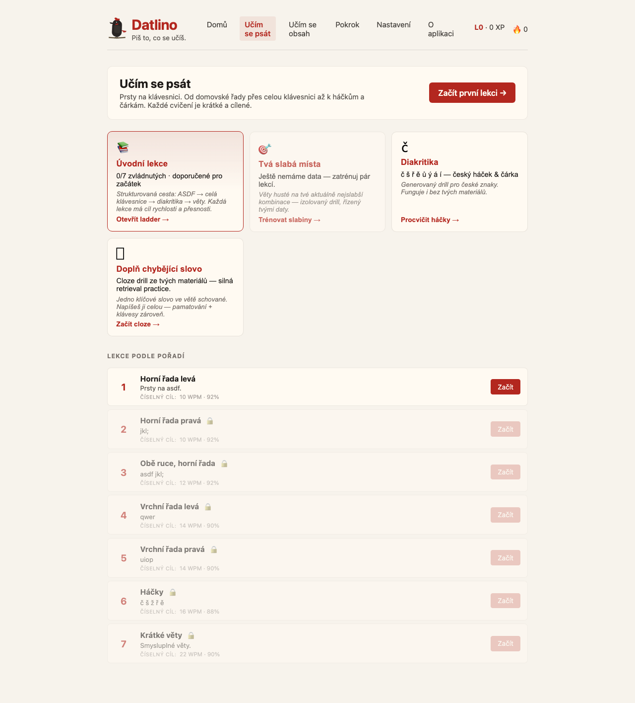
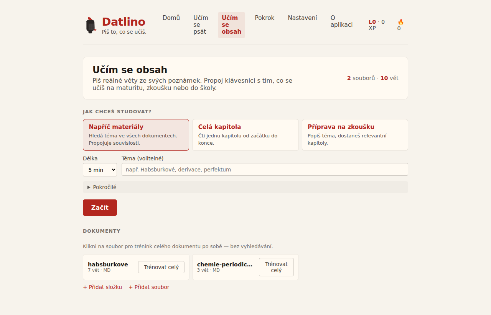

# Datlino

A macOS touch-typing trainer that drills you on your own study materials.
Two modes: a structured course that takes you from the home row to Czech and
Slovak diacritics, and a content mode that turns your notes, textbooks, and
PDF/GoodNotes exports into typing drills. Everything runs locally and offline.
Diacritics (háčky, čárky) are first-class, never stripped.

Built for Czech and Slovak high-school students prepping for Cermat / maturita.

## Install

Apple Silicon Mac, macOS 11 or newer.

1. Download **Datlino_0.1.0_aarch64.dmg** from the
   [v0.1.0 release](https://github.com/Chartres/datlino/releases/tag/v0.1.0)
   ([direct link](https://github.com/Chartres/datlino/releases/download/v0.1.0/Datlino_0.1.0_aarch64.dmg)).
2. Open the DMG and drag **Datlino** to Applications.

The build is signed and notarized, so it opens without a Gatekeeper override.

## What it does

**Učím se psát** — a lesson ladder from the home row through the whole
keyboard to háčky and čárky, plus a drill targeting your weakest keys.

**Učím se obsah** — add your own notes (Markdown, PDF, image/GoodNotes exports;
scanned pages go through OCR) and type real sentences from them. Semantic search
pulls a topic across every document, so practice doubles as exam revision.

## Build from source

See [AGENTS.md](AGENTS.md) for build, test, and release commands.

## License

UNLICENSED — © 2026 Paja Dravec.
